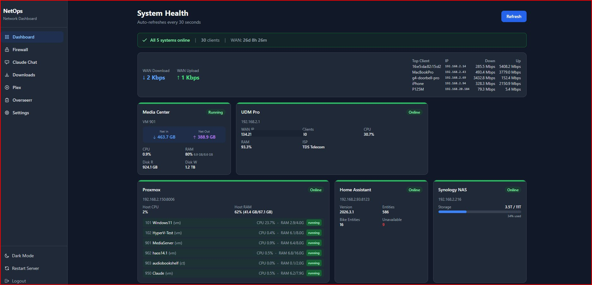

# NetOps Dashboard

A self-hosted network operations dashboard for monitoring and managing home lab infrastructure. Built with Flask, HTMX, and Tailwind CSS.



## Features

- **Real-time system monitoring** — CPU, RAM, disk, and network stats for all systems
- **Live firewall logs** — Stream tcpdump or blocked-traffic logs with filtering, DNS resolution, and IP lookup
- **Device picker** — Browse connected clients from your UDM Pro, filter by status/type, click to filter logs
- **Downloads manager** — Monitor SABnzbd, Sonarr, Radarr, and Prowlarr from one page
- **Plex integration** — Library stats, active sessions, and media search
- **Overseerr integration** — Request stats, pending approvals, and trending media
- **Claude Chat relay** — Chat with Claude CLI directly from the dashboard (read-only mode)
- **Dark/light theme** — System-aware with manual toggle
- **Mobile responsive** — Works on phones and tablets over LAN
- **System tray app** — Start/stop server from the system tray with color-coded status icon
- **PIN protection** — Optional login gate for LAN access
- **Settings page** — Configure all connections, test connectivity, auto-detect API keys

## Supported Systems

| System | Connection | Features |
|--------|-----------|----------|
| UDM Pro | REST API + SSH | Health, clients, firewall rules, live logs |
| Proxmox | REST API + SSH | Node status, VM/CT list with CPU/RAM/net |
| Home Assistant | REST API | Entity states, automations, MQTT status |
| Synology NAS | SSH | Disk usage, volume health, temperatures |
| Bike Computer | SSH (Windows) | Online status, HASS.Agent integration |
| Media Center | SSH (Windows) | VM stats via Proxmox, downloads monitoring |

## Quick Start

1. **Double-click `dashboard.exe`** — the server starts and a system tray icon appears
2. **Right-click the tray icon** — open browser, restart server, or quit
3. **First launch** — a `.env` file is auto-created from `.env.example`. Edit it with your system IPs, credentials, and API keys
4. Open **http://localhost:9000** (default port)

No Python or Node.js install required — the exe is self-contained.

### First-time setup

Visit the dashboard and go to **Settings** to:
1. Enter your system IPs and credentials
2. Use **Test Connection** buttons to verify each system
3. Use **Auto-Detect** to find API keys for Plex, Overseerr, and media services
4. Toggle card visibility and page features

### Other Launch Options

| Method | Command | Use Case |
|--------|---------|----------|
| System tray (default) | Double-click `dashboard.exe` | Recommended for everyday use |
| Launcher script | `start.bat` | Auto-detects mode, creates `.env` if missing |
| Windows service | `start.bat --install` | Run at boot without logging in |
| Service + tray | `start.bat --install --tray` | Service with tray icon |
| Console (debug) | `start.bat --run` | See live server output |
| Tray only | `start.bat --tray` | Tray launcher without service |
| Python (dev) | `cd dashboard && python app.py` | Development with source code |

#### `start.bat` flags

| Flag | Description |
|------|-------------|
| `--install` | Install and start as a Windows service |
| `--uninstall` | Remove the Windows service |
| `--run` | Run in console mode (for debugging) |
| `--tray` | Start with system tray icon |
| `--reinstall` | Force reinstall Python dependencies (dev mode) |

### Uninstall

To remove the Windows service:
```bash
start.bat --uninstall
```
To fully remove, delete the project folder — no registry entries or system files are created outside of it.

## Project Structure

```
├── dashboard.exe              # All-in-one tray app (recommended)
├── dashboard-tray.exe         # Standalone tray icon for service mode
├── dashboard-service.exe      # Windows service executable
├── _internal/                 # PyInstaller runtime (required by .exe files)
├── start.bat                  # Universal launcher script
├── dashboard/
│   ├── app.py                 # Application factory (~145 lines)
│   ├── middleware.py           # CSRF, CSP, security headers, context processors
│   ├── runtime.py             # Path resolution for dev/frozen mode
│   ├── tray.py                # System tray launcher (subprocess mode)
│   ├── dashboard_tray.py      # All-in-one tray launcher (PyInstaller)
│   ├── service_wrapper.py     # Windows service wrapper (pywin32)
│   ├── service_tray.py        # System tray for service mode
│   ├── blueprints/            # Route modules
│   │   ├── auth.py            # Login/logout routes
│   │   ├── health.py          # Dashboard + health API routes
│   │   ├── firewall_bp.py     # Firewall page + streaming routes
│   │   ├── chat_bp.py         # Claude Chat relay routes
│   │   ├── downloads_bp.py    # Downloads manager routes
│   │   ├── plex_bp.py         # Plex integration routes
│   │   ├── overseerr_bp.py    # Overseerr integration routes
│   │   └── settings_bp.py     # Settings page + API routes
│   ├── services/              # Backend service modules
│   │   ├── config.py          # Centralized timeout constants
│   │   ├── dashboard.py       # Main dashboard data aggregator
│   │   ├── udm.py             # UDM Pro API + SSH
│   │   ├── proxmox.py         # Proxmox API
│   │   ├── homeassistant.py   # Home Assistant API
│   │   ├── nas.py             # Synology NAS SSH
│   │   ├── firewall.py        # Live firewall log streaming
│   │   ├── dns_cache.py       # DNS reverse lookup cache
│   │   ├── downloads.py       # SABnzbd/Sonarr/Radarr/Prowlarr
│   │   ├── plex.py            # Plex Media Server API
│   │   ├── overseerr.py       # Overseerr API
│   │   ├── settings.py        # Settings management + connection tests
│   │   ├── claude_relay.py    # Claude CLI chat relay
│   │   ├── claude_md_generator.py  # Auto-generate CLAUDE.md from template
│   │   ├── http_client.py     # Shared HTTP client utilities
│   │   ├── ssh_utils.py       # Shared SSH utilities
│   │   ├── ssh_pool.py        # SSH connection pooling with keepalive
│   │   ├── utils.py           # Shared helpers (format_uptime, etc.)
│   │   ├── portcheck.py       # TCP port connectivity checks
│   │   ├── metrics.py         # Thread-safe counters, histograms, gauges
│   │   ├── correlation.py     # Per-request UUID correlation IDs
│   │   ├── errors.py          # Structured error hierarchy
│   │   ├── audit.py           # Security audit logging
│   │   ├── validators.py      # Schema-based input validation
│   │   ├── startup.py         # Application startup routines
│   │   └── shutdown.py        # Graceful shutdown routines
│   ├── templates/             # Jinja2 templates (HTMX partials)
│   ├── static/                # CSS, JS, favicon
│   └── data/                  # Runtime data (chat history, etc.)
├── scripts/
│   ├── startup-dashboard.js   # CLI startup health check
│   ├── test-connections.js    # Simple port connectivity test
│   └── lib/env-loader.js      # Shared .env loader
├── .env.example               # Template for environment variables
├── requirements.txt           # Python dependencies
├── package.json               # Node.js dependencies
└── claude-template.md         # Template for auto-generated CLAUDE.md
```

## Environment Variables

See `.env.example` for the full list. Key variables:

- **DASHBOARD_PIN** — Optional PIN for login protection (leave empty to disable)
- **DASHBOARD_PORT** — Server port (default: 9000)
- **\*_HOST** — IP addresses for each system
- **\*_API_KEY / \*_TOKEN** — API credentials
- **\*_SSH_USER / \*_SSH_PASS** — SSH credentials
- **SHOW_\*** — Toggle dashboard cards and pages
- **PLEX_ENABLED / OVERSEERR_ENABLED** — Enable optional integrations

## Security & Hardening

This build includes the following hardening improvements:

- **Health check caching** — 20-second TTL with double-check locking prevents thundering herd on concurrent requests
- **Rate limiting** — Login (5/min) and settings save (10/min) endpoints are rate-limited via flask-limiter
- **CORS restriction** — Cross-origin requests restricted to local network (192.168.x.x, localhost, 127.0.0.1)
- **Command injection protection** — Firewall IP lookup validates input with regex and uses `shlex.quote()`
- **Structured logging** — RotatingFileHandler (5MB, 3 backups) replaces print statements
- **Atomic chat history writes** — Uses `tempfile.mkstemp()` + `os.replace()` to prevent corruption
- **Thread-safe WebSocket state** — `threading.Lock()` guards firewall stream and chat session dictionaries
- **DNS cache with LRU eviction** — OrderedDict-based cache with thread-safe access
- **Firewall buffer cap** — 64KB limit on SSH stream buffer prevents unbounded memory growth
- **Claude CLI timeout** — 300-second process timeout prevents zombie subprocesses
- **HTTP client timeouts** — Default (3s connect, 8s read) on all outbound requests
- **Cache-Control headers** — `private, max-age=15` on HTMX partial responses
- **Environment validation** — Startup check warns about missing required/optional env vars
- **O(1) DNS hostname updates** — IP→Element maps replace querySelectorAll scans in firewall logs
- **rAF render batching** — requestAnimationFrame batching for smooth realtime log rendering
- **.env value escaping** — Special characters in settings values are properly escaped
- **Blueprint architecture** — Routes split into 8 focused blueprints with shared middleware
- **Correlation IDs** — Per-request UUID for log tracing across service calls
- **Audit logging** — Security-relevant actions (login, settings, lookups) logged to separate audit.log
- **Input validation** — Schema-based validation for settings, system IDs, and search queries
- **Structured errors** — Error hierarchy with system/operation/correlation_id for debugging
- **SSH connection pooling** — SSHPool class with keepalive checks, metrics, and safe_close()
- **CORS subnet validation** — Proper IP parsing against configurable subnet (not just string prefix)
- **CSP violation reporting** — report-uri endpoint logs Content-Security-Policy violations
- **Metrics collection** — Thread-safe counters, histograms, and gauges exposed via /api/health

## Architecture

- **Blueprints** — 8 route modules under `blueprints/`
- **Circuit breaker** — Per-system failure tracking (3 failures → 60s cooldown), returns cached results when open
- **Thread pool** — `ThreadPoolExecutor(max_workers=7)` runs all health checks in parallel
- **HTTP retry** — Automatic retry with exponential backoff on 502/503/504
- **DNS cache** — LRU eviction (2000 entries), async resolution, TTL-based expiry
- **Atomic writes** — Chat history uses temp file + `os.replace()` to prevent corruption
- **Result caching** — 20s TTL with double-check locking prevents thundering herd

## Notes

- Uses **HTTP** for Home Assistant (not HTTPS) — standard for LAN installations
- Uses **HTTPS with self-signed certs** for UDM Pro and Proxmox (certificate verification disabled)
- SSH to UDM Pro and Synology NAS uses **keyboard-interactive** auth
- SSH to Windows machines (Bike Computer, Media Center) uses **PowerShell** commands
- The Claude Chat relay runs in **read-only mode** by default (no file edits)
- CLAUDE.md is auto-generated from `claude-template.md` when settings are saved

## License

MIT
